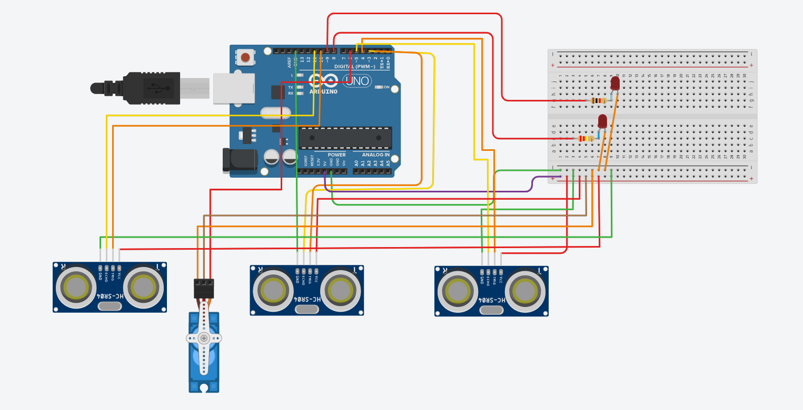

# Smart Parking System 🚗

An Arduino-based smart parking system that uses ultrasonic sensors to detect parking-slot availability and a servo motor to control the entrance barrier.

## Features

- 🚗 Detects vehicles using ultrasonic sensors
- 🅿️ Monitors parking-slot availability
- 🚦 Indicates slot status using LEDs
- 🚧 Automatically opens and closes the entrance barrier
- 📟 Displays parking information through Serial Monitor

## Components Used

- Arduino Uno
- 3 × Ultrasonic Sensors (HC-SR04)
- Micro Servo Motor
- 2 × LEDs
- Resistors
- Breadboard
- Jumper Wires

## Working

1. The entrance ultrasonic sensor detects an approaching vehicle.
2. The system checks whether parking space is available.
3. If a slot is available, the servo motor opens the barrier.
4. The LEDs indicate whether parking slots are FREE or FULL.
5. If all slots are occupied, the barrier remains closed.

## Pin Configuration

| Component | Arduino Pin |
|---|---|
| Servo Signal | D6 |
| LED 1 | D8 |
| LED 2 | D9 |

## Simulation

The project was designed and tested using Tinkercad Circuits.

## Author

Yogirawat999
## Circuit Diagram

